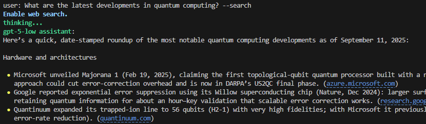

# 🚀 CLI Chatbot Using the OpenAI Responses API

## 📖 Overview

A command-line chatbot powered by the OpenAI Responses API.  
It supports conversation history, file analysis, instant saving, and web search.  
Uses event streaming and `previous_response_id` to maintain context efficiently.

---

## ✨ Features

* 🗨️ Conversational interface with context-aware replies  
* ⌨️ Advanced input options:
  - Multi-line prompt input (Enter = new line, Alt+Enter = send)
  - Emacs-style shortcuts (e.g., Ctrl+A, Ctrl+E, Ctrl+K, etc.)
* 💾 Conversation history saved to `./history`
* 📂 File input via lines starting with `~␣` (tilde + space):
  - Text-based files (`.txt`, `.csv`, `.py`, `.md`, etc.)
  - Excel files (`.xlsx`, automatically converted to JSON)
  - PDF files (`.pdf`, supports both local files and URLs)
  - Images (`.jpg`, `.jpeg`, `.png`, supports both local files and URLs)
* 🌐 Web search using the `--search` flag for up-to-date answers
* ⚡ Instant save using `!save` command

---

## ⚙️ Requirements

- Python **3.10+**
- Install dependencies:
  ```bash
  pip install -r requirements.txt
  ```

**Optional (Windows):**  
Use [Windows Terminal](https://apps.microsoft.com/detail/windows-terminal/9N0DX20HK701) for better rendering and fewer artifacts.

---

## 🔑 Setup

1. **Set API Key**

   ```bash
   setx OPENAI_API_KEY "your_api_key_here"   # Windows
   export OPENAI_API_KEY="your_api_key_here" # Linux / macOS
   ```

2. **Configure Settings**

   Copy `settings_example.py` → `settings.py` and edit:

   ```python
   PROMPT = "You are a helpful assistant. Respond in well-structured Markdown."
   MODEL = "gpt-5"  # gpt-5 | gpt-5-mini | gpt-5-chat-latest | gpt-5-codex | gpt-4.1 | gpt-4.1-mini | o4-mini | o3 | gpt-4o
   TEMPERATURE = 1.0
   STREAM = True     # True | False
   REASONING_EFFORT = "medium"  # low | medium | high | minimal
   COUNTRY = "JP" # Two-letter ISO country code for web search
   ```

3. **Run**

   ```bash
   python clichatbot.py
   ```

   *(Windows users can use `script/wt-openai.bat` to launch in Windows Terminal.)*

---

## 💬 Usage

### Basic Chat
Type your question.  
- `Enter` → new line  
- **`Alt+Enter`** (or `Esc` then `Enter`) → send message  

```plaintext
user: Your question
```

### File Analysis
Multiple files supported  (each file path on a new line starting with **`~␣`**):

```plaintext
user: Explain these files
~ /path/to/example.py
~ /path/to/document.pdf
~ /path/to/image.png
```

### Image / PDF via URL
```plaintext
user: Are these files related?
~ https://example.com/image.jpg
~ https://example.com/document.pdf
```

### Web Search
```plaintext
user: What are the latest developments in quantum computing? --search
```

### Exit Session
Press **`Alt+Enter`** (or `Esc` then `Enter`) on empty input → history is saved to `./history`.

### Instant Save
```plaintext
user: !save
```

---

## ⌨️ Keyboard Shortcuts (while editing a prompt, Emacs-style)

- `Ctrl + A` → Move cursor to beginning of line  
- `Ctrl + E` → Move cursor to end of line  
- `Ctrl + U` → Delete to beginning of line  
- `Ctrl + K` → Delete to end of line  
- `Ctrl + D` → Delete character under cursor  
- `Ctrl + H` → Backspace  

---

## 🖼️ Example

```plaintext
user: Explain these files
~ clichatbot.py
~ settings_example.py
Completed loading the file: 'clichatbot.py'
Completed loading the file: 'settings_example.py'
gpt-5-medium assistant:
Here’s a clear walkthrough of what each file does, how to use the CLI chatbot, and how the pieces fit together.

Overview

- clichatbot.py: A command-line chatbot that talks to OpenAI’s Responses API. It supports:
  - Streaming and non-streaming outputs
...
```

```plaintext
user: Analyze the letter and provide a summary of the key points.
~ https://www.berkshirehathaway.com/qtrly/2ndqtr25.pdf
Processing the file: 'https://www.berkshirehathaway.com/qtrly/2ndqtr25.pdf'
gpt-5-medium assistant:
Here’s a concise, decision‑oriented summary of Berkshire Hathaway’s Q2 2025 Form 10‑Q.

Headline results
- Net earnings attributable to Berkshire shareholders: $12.37B for Q2 (vs. $30.35B in Q2’24); $16.97B for 1H’25 (vs. $43.05B in 1H’24).
- Revenues: $92.5B in Q2 (−1% YoY); $182.2B in 1H (−1% YoY).
...
```

<p align="left"></p>

---

## ⚙️ Configuration

- **PROMPT** → System prompt for the assistant (e.g., `"You are a helpful assistant."`)
- **MODEL** → OpenAI model (`gpt-5`, `gpt-4.1`, `o4-mini`, etc.)
- **TEMPERATURE** → Higher = more creative, Lower = more deterministic
- **STREAM** → Stream output (`True`/`False`)
- **REASONING_EFFORT** → Controls reasoning depth (`low`, `medium`, `high`, `minimal`)
- **COUNTRY** → ISO country code (e.g., `US`, `JP`) for localized web search

---

## 📝 Notes

- **Reasoning usage**:
  - Valid only for reasoning models (`gpt-5`, `o1–o9`), excluding `gpt-5-chat-latest`.
  - `minimal` → intended for `gpt-5`, `gpt-5-mini`, `gpt-5-nano`.
  - For `o1–o9`, `minimal` falls back to `low`.
- **STREAM=False** → single Markdown-rendered reply per turn.
- If an error occurs with an HTTP-linked PDF, try downloading the file first.

---

## 📜 License

MIT
